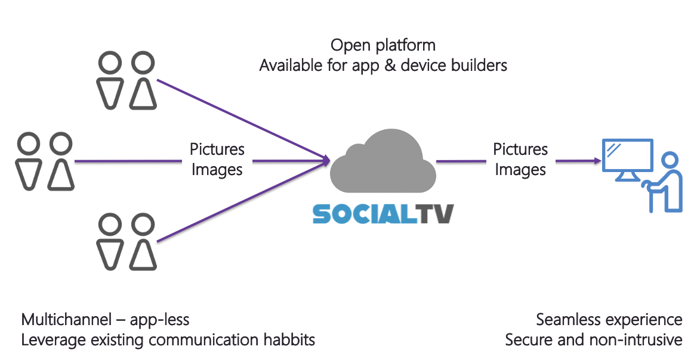

### We want to offer a seamless experience for isolated people to stay somewhat connected with friends and family

[](https://dev.azure.com/codit/Hack%20the%20crisis/_build/latest?definitionId=824&branchName=master)

## Description
This is a cloud based application that we build for Hack The Crisis, an attempt to leverage cloud technology to help elderly people in isolation
In these times of crisis (but quite often also in the everyday live), elderly people can become somewhat isolated from their friends and family.  People in an elderly home, people in their own home.  Quite a lot of them have the television as their main 'hobby'.  
At the same time, the family (grandchildren, children and even great-grandchildren) are exchanging pictures, text images using their modern apps and cell phones. 
SocialTV wants to embrace both "user types" and bring them together in a seamless, but secure, experience.  



## Services

Our solution consist of the following parts:

### Television (web app in demo): 
- Shows activation screen when new
- Shows pictures and text images in a carrousel mode, automatically adding pictures and messages along the way
- No need for interaction, just consume/read-only

### Multi-channel Chatbot interface (WhatsApp channel in demo):
- Allows for family members to activate and connect with the television app
- Allows for family members to send text messages and images, using their existing communication tools
- Allows for 'commands' for family admin

### Cloud platform (built on Microsoft Azure):
- Hosts chatbot experience to handle conversation flow, stream and send messages and connect family members
- Hosts and dispatches pictures and text messages
- Exposes functionality through API that can be consumed by apps and devices

## Interaction and conversation flow

### WhatsApp chat conversation flow

- User adds SocialTV as contact, using the provided WhatsApp number
- User sends first initial activation message
- Upon successful validation, the user is welcomed and asked for his/her name
- After sending the name, the user is indicated and asked to send an activation code that appears on the screen of the box (see next section)
- The user now sends the activation code in reply and gets a confirmation if everything is right (or a warning to retry as the code is incorrect)
- Now that the user is linked to the box, every message that will be sent (both images and text) will be delivered to the right box through a persisted layer in the cloud.

__Example flow__:
```
User > Hi

SocialTV > Welcome to SocialTV, what's your name, please?

User > Robert

SocialTV > Welcome Robert, if you want to link to a box, please send us the activation code that appears on the screen of the box

User > EKDHE

SocialTV > Thanks, the box is now being set up.  You can start sending messages and images to me and I'll show them on the box. 
```

### Linking family admin with a connected box


For more information, see [#3](https://github.com/CoditEU/htc-social-connect/issues/3).

### WhatsApp other family members activation flow

These users (that want to join a conversation with a box) will follow the exact same logic, but they can get the activation code from the family admin and don't have to call the person at the "box-side".  

### System messages

It is possible to send 'system messages' to the bot to ask for information:

- __*exit__: When doing this, a user will be disconnected from a box and has to send an activation code again, to join another (or the same) box
- __*show__: When doing this, the user gets a link back that shows the box like the end user sees it.
- __*stats__: (not implemented yet): the user gets a summary of the box (last connected, number of users linked to it, number of messages and images)
- __*clear__: (not implemented yet): all data for the buser will be removed in the cloud